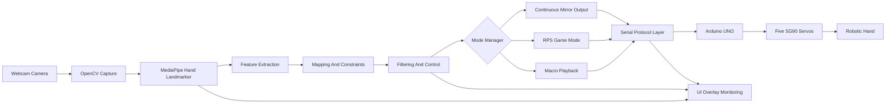
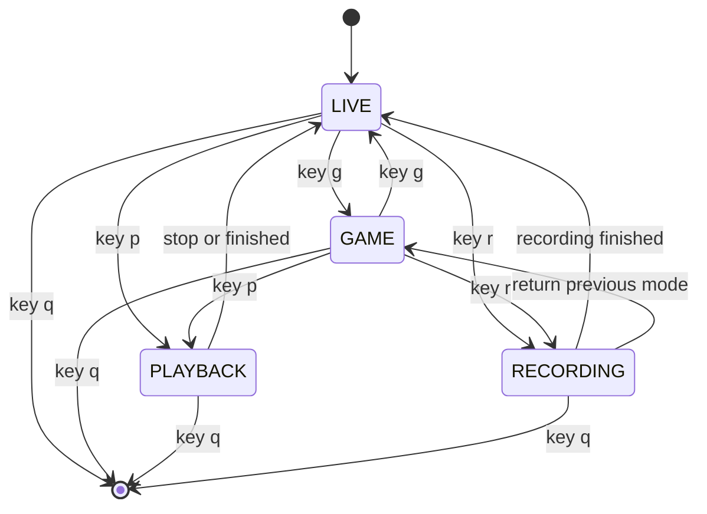
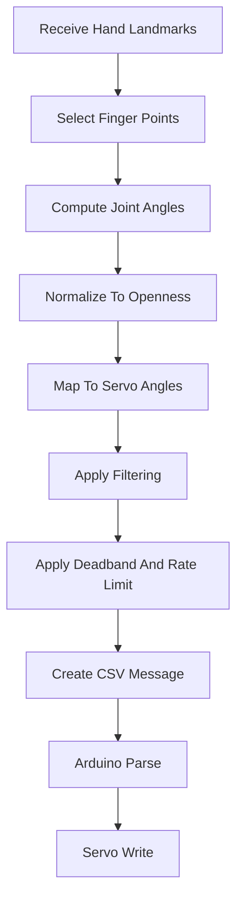
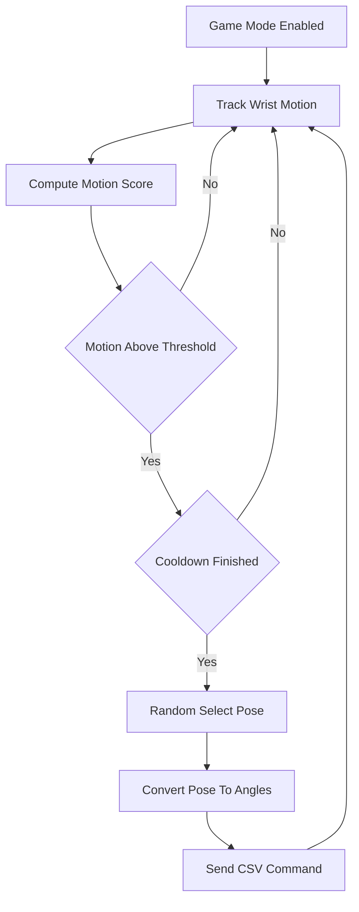
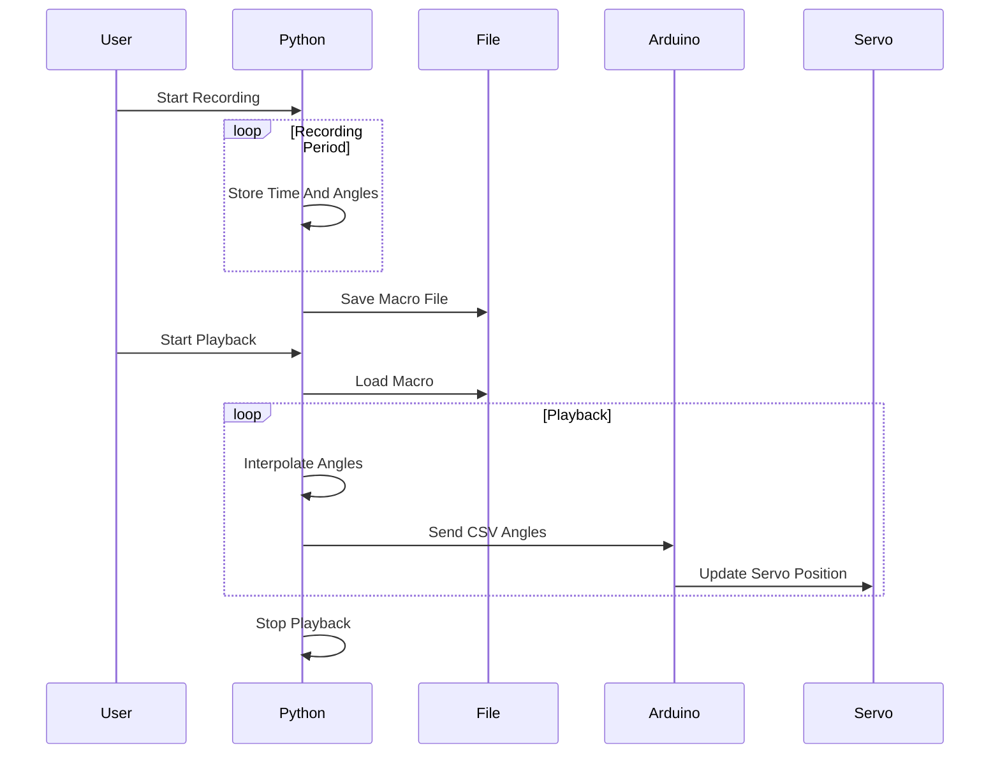
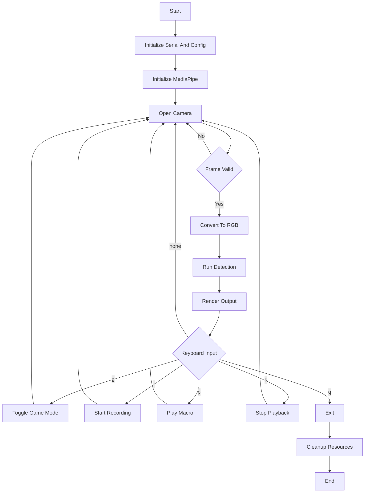
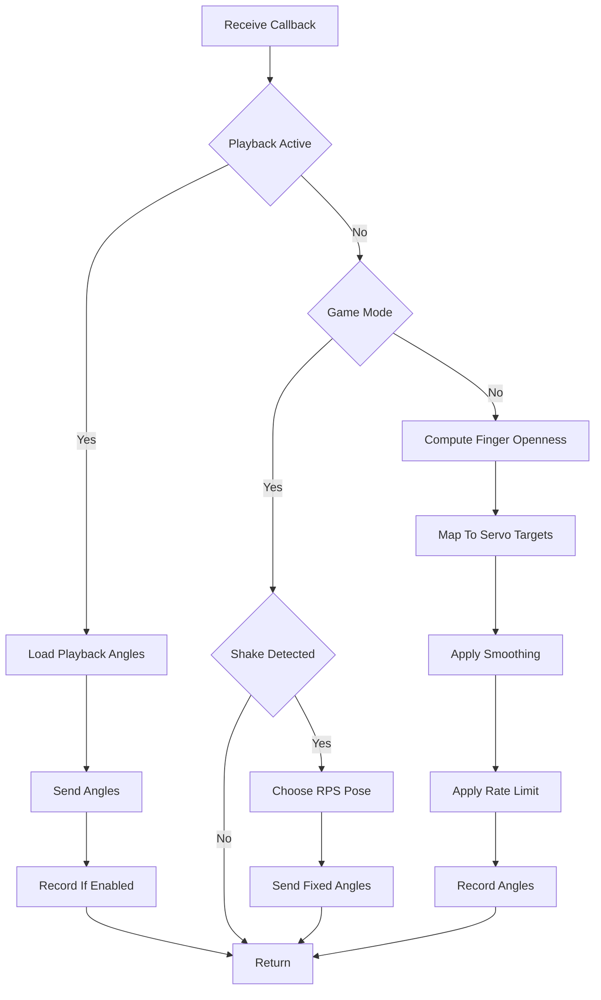

# Extra Diagrams for Report (Final Mermaid Version)

---

## 1) System / Block Diagram (Architecture)

---

## 2) Software State Machine

---

## 3) Detailed Data Flow

---

## 4) RPS Game Mode Logic

---

## 5) Macro Recording And Playback

---

## 6) High Level Program Flow

---

## 7) Callback Control Pipeline

