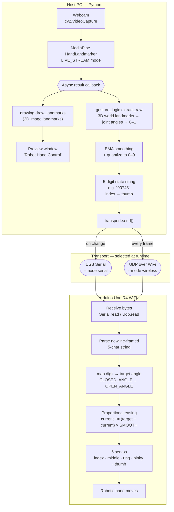

# Gesture Responsive Intelligent Prosthetic (GRIP) - 5

<div align="center">
  
</div>

## Overview

**GRIP-5** (Gesture Responsive Intelligent Prosthetic) is a vision-controlled prosthetic hand. A webcam watches your hand, MediaPipe locates 21 hand landmarks in 3D, and GRIP-5 turns the geometry of your finger joints into smooth, proportional motion of five servo-driven fingers on the robotic hand.

The emphasis is on **natural motion**. Rather than snapping each finger between "open" and "closed," GRIP-5 measures *how far* each finger is bent as a continuous value, smooths it, and the microcontroller eases the servos toward each new target — so when your hand opens slowly the robot opens slowly, and when you open it quickly the robot follows quickly. The mapping is the human hand's own joint angles, not a trained classifier, which keeps the behaviour transparent and easy to tune.

---

## Features

- **Continuous, proportional control** — every finger reports one of ten openness levels (0–9), not a binary open/closed, so the robot tracks partial bends.
- **Rate-responsive motion** — the microcontroller eases each servo a fraction of the remaining distance every loop, so motion speed naturally follows how fast you move your hand.
- **Orientation-independent sensing** — finger flexion is computed from MediaPipe's 3D *world* landmarks, so it works whether your palm faces the camera straight-on or at an angle.
- **Two transports, one interface** — send commands over USB **serial** or wirelessly over **UDP/WiFi** (Arduino Uno R4 WiFi), selected at runtime with a single flag.
- **Calibratable** — per-finger and thumb thresholds live in one config file and are tuned with a built-in debug readout.
- **Modular codebase** — sensing, geometry, smoothing, transport, and drawing are separated, so each piece can be tested or swapped on its own.

---

## How It Works

The signal path from camera to servo, per frame:

1. **Capture & detect** — a webcam frame is passed to MediaPipe's `HandLandmarker` running in `LIVE_STREAM` mode. Results arrive on an asynchronous callback.
2. **Use 3D world landmarks** — the 2D image landmarks are used only for the on-screen overlay; the geometry uses `hand_world_landmarks`, which are metric 3D coordinates independent of camera projection. This is what makes a finger curling *toward* the lens still register as bent.
3. **Per-finger flexion** — for index, middle, ring and pinky, the angle at the PIP joint (≈180° straight, small when curled) is measured and remapped to a `0.0–1.0` openness value.
4. **Thumb** — the thumb uses the angle at its IP joint (landmarks 2–3–4), remapped the same way. (Earlier distance-based metrics were dropped because they failed when the fingers were extended but the thumb was tucked across the palm.)
5. **Smooth** — each finger's value is passed through an exponential moving average (EMA) to suppress landmark jitter.
6. **Quantize** — each smoothed value is rounded into one of `N_STEPS` levels, producing a 5-character string like `"90743"` in **index → middle → ring → pinky → thumb** order.
7. **Transmit** — the string (newline-terminated) is sent to the microcontroller over serial or UDP.
8. **Actuate with easing** — the MCU maps each digit to a servo angle and moves the servo a fraction of the remaining distance each loop (`current += (target − current) * SMOOTH`), giving mechanically smooth, rate-aware motion between commands.


The result is two layers of smoothing — EMA on the host, proportional easing on the MCU — which together produce fluid movement from discrete commands.

---

## Hand Landmark Reference

GRIP-5 relies on MediaPipe's 21-point hand model:

<div align="center">
  

  *MediaPipe hand landmark indices — the joint triplets used for flexion are derived from these points.*
</div>

The joint triplets used:

| Finger | Landmarks (MCP, PIP, TIP) | Metric |
|--------|---------------------------|--------|
| Index  | 5, 6, 8                   | PIP joint angle |
| Middle | 9, 10, 12                 | PIP joint angle |
| Ring   | 13, 14, 16                | PIP joint angle |
| Pinky  | 17, 18, 20                | PIP joint angle |
| Thumb  | 2, 3, 4                   | IP joint angle  |

---

## Hardware

| Component | Role |
|-----------|------|
| Webcam | Captures the controlling hand |
| Host PC | Runs MediaPipe + the control pipeline |
| Arduino Uno R4 WiFi | Receives commands (serial or UDP) and drives the servos |
| 5 × servos | One per finger |
| Power supply | Servo power (size to your servos) |

Default servo wiring (defined in `mcu/mcu.ino`):

| Finger | Servo index | Pin |
|--------|-------------|-----|
| Index  | 0 | 9  |
| Middle | 1 | 12 |
| Ring   | 2 | 3  |
| Pinky  | 3 | 11 |
| Thumb  | 4 | 6  |

> The servo order in firmware must match the string order from the host (index → thumb), or the wrong fingers will move for a gesture.

<div align="center">
  

  *GRIP-5 v1 circuit architecture.*
</div>

---

## Project Structure

```
GRIP-5/
├── README.md                  # This file
├── LICENSE                    # GNU General Public License v3.0
├── requirements.txt           # Python dependencies
├── config.py                  # Tunables: thresholds, EMA, IP/port, model path
├── gesture_logic.py           # Pure geometry: joint angles, raw openness extraction
├── transport.py               # Serial + UDP transports behind a common interface
├── drawing.py                 # Landmark / connection overlay
├── main.py                    # Camera loop + MediaPipe callback wiring
├── hand_landmarker.task       # MediaPipe hand landmark model
├── rps.py                     # The Rock-Paper-Scissors Game Mode functions
├── media/
│   ├── GRIP5-Theme.png
│   ├── GRIP5-v1-Circuit-Diag.png
│   └── hand-landmarks.png
└── mcu/
    ├── mcu.ino                # Arduino firmware (serial + UDP, proportional easing)
    └── test.cpp              # C++ testing file
```

---

## Installation

### Prerequisites

- Python 3.9+
- Arduino IDE (to flash `mcu/mcu.ino`)
- A webcam

### Setup

1. **Clone**
   ```bash
   git clone https://github.com/SUNSET-Sejong-University/GRIP-5.git
   cd GRIP-5
   ```

2. **Virtual environment**
   ```bash
   python -m venv venv
   source venv/bin/activate      # Windows: venv\Scripts\activate
   ```

3. **Dependencies**
   ```bash
   pip install -r requirements.txt
   ```

   `requirements.txt`:
   ```
   mediapipe
   opencv-python
   numpy
   pyserial
   ```

4. **Flash the firmware** — open `mcu/mcu.ino` in the Arduino IDE, select your Uno R4 WiFi, and upload.

---

## Usage

Run the host application, choosing a transport with `--mode`:

```bash
# Wireless (UDP over WiFi) — default
python main.py --mode wireless

# Wired (USB serial)
python main.py --mode serial
```

Hold your hand in front of the camera; the robotic hand mirrors your finger positions. Press **`q`** in the preview window to quit.

### Wireless setup

In `config.py`, set `ARDUINO_IP` and `ARDUINO_PORT` to match the board. On a normal LAN, read the IP the Arduino prints to its Serial Monitor on boot.

If you're on a guest/managed network that blocks device-to-device traffic (or assigns no IP), have the **Arduino host its own access point** instead: the board comes up at a fixed `192.168.4.1`, you connect your PC's WiFi directly to the board's network, and point `ARDUINO_IP` at `192.168.4.1`. This needs no router and works anywhere. Verify connectivity with `ping <ARDUINO_IP>` before running.

### Serial setup

Update the port in `transport.py` (`/dev/ttyACM0` on Linux, e.g. `COM3` on Windows). The serial transport pulses DTR to reset the board and waits for `setup()` before sending.

---

## Calibration

All tunables live in `config.py`. To calibrate, set `DEBUG = True` to print raw per-finger values, then:

- **Fingers** — fully extend (values near the open angle) and make a fist (near the closed angle). Adjust `FINGER_OPEN_ANGLE` / `FINGER_CLOSED_ANGLE` to bracket your real range.
- **Thumb** — tuck the thumb and splay it out, note the two IP-joint angles, and set `THUMB_CLOSED` / `THUMB_OPEN` just inside those readings. Calibrate with your palm facing the camera, the hardest case.

Other knobs:

| Setting | Effect |
|---------|--------|
| `N_STEPS` | Resolution per finger (default 10 → digits 0–9) |
| `EMA_ALPHA` | Smoothing on the host (higher = snappier, lower = smoother but laggier) |
| `SMOOTH` *(in `mcu.ino`)* | Easing rate on the MCU (higher = snappier) |

---

## Communication Protocol

The host sends a newline-terminated, fixed-width string each update:

```
"90743\n"
 │││││
 ││││└─ thumb   (0 = closed … 9 = open)
 │││└── pinky
 ││└─── ring
 │└──── middle
 └───── index
```

The firmware buffers characters until a newline, maps each digit to a servo angle between `CLOSED_ANGLE` and `OPEN_ANGLE`, and eases the servos toward those targets. The same parser is fed from either the serial port or incoming UDP packets, so the two transports share identical firmware-side handling. Over serial the host sends only on change; over UDP it sends every frame, so a dropped packet self-corrects on the next one.

---

## Contributing

1. Fork the repo and create a feature branch:
   ```bash
   git checkout -b feature/your-feature-name
   ```
2. Make and test your changes.
3. Commit with a clear message and open a Pull Request.

---

## Performance

Performance depends on your camera, host, and servos. If you publish figures here (latency, tracking FPS, servo response), measure them on your own setup rather than quoting estimates — for example, time the camera-to-servo path and log the achieved frame rate from the capture loop.

---

## License

Licensed under the **GNU General Public License v3.0**. See [LICENSE](LICENSE) for details.

---

## Acknowledgments

- **MediaPipe** — hand landmark detection
- **OpenCV** — computer vision pipeline
- **MINES Lab** — Mobile Intelligence and Embedded Systems Lab
- **Contributors** — Basnet Prashant and Das Prithwis

---

## Contact

- **Organization**: [SUNSET — Sejong University](https://github.com/SUNSET-Sejong-University)
- **Issues**: [GitHub Issues](https://github.com/SUNSET-Sejong-University/GRIP-5/issues)
- **Discussions**: [GitHub Discussions](https://github.com/SUNSET-Sejong-University/GRIP-5/discussions)

---

<div align="center">
  <p><strong>GRIP-5: Making Prosthetics More Intuitive Through Gesture Recognition</strong></p>
  <p>Built with ❤️ by SUNSET at Sejong University</p>
</div>
