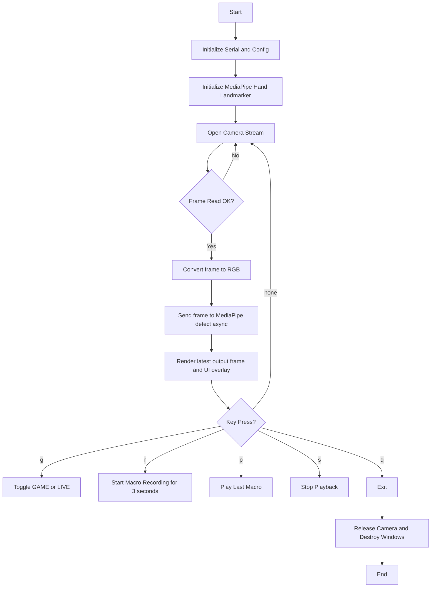
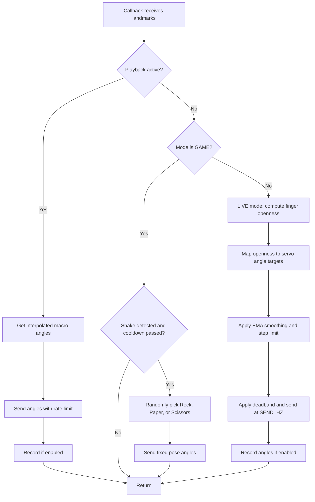

# GRIP-5: Vision-Controlled 5‑DOF Robotic Hand (MediaPipe + Arduino UNO) — Software Engineering Report 

> Course: Basic Software Coding (Software Development Concepts applied to Hardware Project)  
> Date: 2026-06-02  
> Repository: `SUNSET-Sejong-University/GRIP-5`  
> Project Description: A 5‑DOF robotic hand that leverages MediaPipe CV to achieve real-time anthropomorphic gesture mirroring.

---

## 1. Abstract

GRIP‑5 is a vision-based robotic hand control system that mirrors a user’s hand gestures in real time using a webcam, MediaPipe hand landmark detection, and an Arduino UNO driving five SG90 servo motors. The system converts detected hand pose into continuous (partial) servo angles, filters commands to reduce jitter, and transmits commands to the microcontroller via serial communication. Additional software features include Macro Recording/Playback (recording a 3‑second motion sequence and replaying it smoothly) and a Rock‑Paper‑Scissors (RPS) game mode triggered by a shake gesture.

This report documents the system architecture, software development lifecycle (SDLC) artifacts, flowcharts, module design, testing strategy, and future work.

---

## 2. Problem Statement & Motivation

### 2.1 Problem
Direct binary gesture control (open/close) caused unstable behavior: a small finger movement on the user side resulted in a full servo movement on the robot side, making the robotic hand feel **too sensitive** and unnatural.

### 2.2 Goals
1. Real-time control of a 5‑DOF robotic hand using computer vision.
2. Support **continuous finger motion** (e.g., half-open finger → half-open servo position).
3. Reduce jitter and oversensitivity using filtering and rate limiting.
4. Add expandable features that demonstrate software engineering concepts:
   - Modularization
   - Recording/playback
   - State machines (mode switching)
   - Logging/monitoring
   - Test plan

### 2.3 Non-Goals (Current Scope)
- Force/torque sensing and closed-loop feedback control (future work).
- Full hand kinematics modeling beyond joint angle heuristics.

---

## 3. Hardware & Circuit Overview

### 3.1 Components
- **Arduino UNO** (ATmega328P)
- **5× SG90 Servo Motors** (one per DOF)
- **Webcam** (PC camera)
- **9V Battery** + **Step-down Buck Converter** to power servos
- Shared ground between Arduino and servo power

### 3.2 Wiring (Summary)
Servo signal pins (PWM) connected to Arduino digital pins:
- Servo 1 → D3  
- Servo 2 → D6  
- Servo 3 → D9  
- Servo 4 → D11  
- Servo 5 → D12  

Power wiring:
- Battery → Buck converter input (UIN+/UIN-)
- Buck converter output (UOUT+/UOUT-) → servo Vin and GND
- Arduino GND connected to servo GND (common ground)

> Note: Servo current draw can be high. If instability occurs (servo jitter/reset), consider a higher current 5V supply (e.g., 2–5A).

---

## 4. Software Requirements

### 4.1 Functional Requirements
FR1. Detect a human hand in the webcam feed and extract landmarks.  
FR2. Convert landmarks into continuous finger openness values (0–1) and then to servo angles.  
FR3. Send servo commands to Arduino via serial communication.  
FR4. Implement filtering and rate limiting to reduce jitter and oversensitivity.  
FR5. Provide **Macro Recording** (3 seconds) and **Playback** with smooth motion.  
FR6. Provide **RPS Game Mode**: shake gesture triggers a random pose (Rock/Paper/Scissors).  
FR7. Provide a visual overlay UI: mode, recording/playback status, last angles.

### 4.2 Non-Functional Requirements
NFR1. Real-time responsiveness (target control update ~20Hz).  
NFR2. Stability: avoid high-frequency servo oscillation (deadband + smoothing).  
NFR3. Safety: clamp servo angles to mechanical limits.  
NFR4. Maintainability: modular code structure with clear responsibilities.

---

## 5. System Architecture (System/Block Diagram)

### 5.1 Block Diagram (Text Form)

**Webcam**
→ Frames (OpenCV)
→ **MediaPipe Hand Landmarker**
→ Hand landmarks (21 points)
→ **Gesture/Angle Extraction**
→ Finger openness (0–1)
→ **Mapping + Filtering**
- servo mapping (min/max)
- smoothing (EMA)
- deadband
- rate limit
→ **Serial Protocol Layer**
→ CSV angle command: `idx,mid,ring,little,thumb\n`
→ **Arduino UNO**
→ PWM signals
→ **5× SG90 Servos**
→ Robotic hand motion

### 5.2 Modular Software Components (Python)
- `vision.py`: MediaPipe Live Stream detection callback wrapper
- `control.py`: angle computation, openness mapping, smoothing, deadband, rate limiting
- `serial_io.py`: serial sender (CSV protocol)
- `macro.py`: record and playback motion sequences (CSV file)
- `game_rps.py`: shake detection and RPS pose selection
- `ui.py`: overlay rendering (status, angles, hints)
- `config.py`: all constants and tuning parameters
- `main.py`: app orchestration and event loop

### 5.3 Arduino Firmware Components
- CSV parsing of 5 angle values
- Servo attachment + clamped applyAngles()

---

## 6. Software Flowcharts

### 6.1 High-Level Program Flow (Main Loop)

### 6.2 Callback Decision Flow (Core Control Pipeline)

---

## 7. Algorithms & Key Design Choices

### 7.1 Continuous Finger Motion
Instead of binary open/close detection, the project computes a continuous “openness” value per finger. A stable approach is based on joint angles:
- Example: Index finger uses angle at PIP joint from landmarks (MCP, PIP, TIP).
- Larger angle (~175°) indicates straight finger; smaller angle (~95°) indicates bent finger.

Normalize:
- `open01 = clamp((angle - CLOSED_ANGLE) / (OPEN_ANGLE - CLOSED_ANGLE), 0..1)`
Then map to servo:
- `servo_deg = min_deg + open01*(max_deg - min_deg)`

### 7.2 Filtering & Stability (Solving Oversensitivity)
To reduce jitter and unnatural movement:
- **EMA smoothing**: reduces sudden jumps due to landmark noise
- **Step limiting**: caps the maximum degree change per update
- **Deadband**: ignores changes smaller than ~2 degrees
- **Fixed send rate**: sends commands at ~20Hz even if camera FPS is higher

### 7.3 Serial Protocol (CSV Angles)
Binary protocol `"10110"` cannot represent partial motion. We use a continuous protocol:
- Message format: `idx,mid,ring,little,thumb\n`
- Example: `90,120,60,45,110\n`

Arduino parses the CSV and updates servos.

### 7.4 Macro Recording / Playback
- Record: store angles with timestamps for 3 seconds
- Save: CSV file
- Playback: resample at fixed `PLAY_HZ` using linear interpolation between recorded frames

### 7.5 RPS Game Mode (State Machine + Gesture Trigger)
- Mode toggled using key `g`
- Shake detection uses wrist landmark path length over a short window
- On shake: randomly choose one of three predefined poses:
  - Rock: closed fist
  - Paper: open hand
  - Scissors: index + middle open

---

## 8. Software Development Lifecycle (SDLC) Applied

### 8.1 Requirements Phase
- Identify system inputs/outputs, constraints, and success criteria (Section 4).
- Define acceptance tests (Section 9).

### 8.2 Design Phase
- Architecture diagram (Section 5).
- Flowcharts and callback logic (Section 6).
- Definition of modules and responsibilities.

### 8.3 Implementation Phase (Iterative)
Milestone approach:
1. Landmarks visualized on camera feed
2. Binary open/close → serial send
3. Continuous openness mapping
4. Filtering for stability
5. Macro record/playback
6. GAME mode with shake trigger

### 8.4 Testing Phase
- Unit tests where feasible (math + mapping)
- Integration tests: landmarks→angles→serial→servo response
- Hardware-in-loop tests for safety and reliability

### 8.5 Deployment / Demonstration
- Document setup steps:
  - install dependencies
  - upload Arduino firmware
  - run Python script
- Demonstrate modes and features

---

## 9. Testing Plan

### 9.1 Unit-Level Tests (Logic)
| Test ID | Component | Input | Expected Output |
|---|---|---|---|
| U1 | `openness_from_angle` | angle=CLOSED_ANGLE | open01 ≈ 0 |
| U2 | `openness_from_angle` | angle=OPEN_ANGLE | open01 ≈ 1 |
| U3 | servo mapping | open01=0.5 | servo near mid-range |
| U4 | deadband | angles change <2° | no serial send |
| U5 | step limit | jump of 50° | output changes ≤ MAX_STEP_DEG per update |

### 9.2 Integration Tests (End-to-End)
| Test ID | Scenario | Steps | Expected Result |
|---|---|---|---|
| I1 | Live partial motion | slowly half-open index finger | servo moves to mid-range |
| I2 | Tracking loss | remove hand from frame | servos stop updating (stable) |
| I3 | Macro record/play | record 3 seconds, play back | similar motion repeats |
| I4 | GAME mode | toggle GAME, shake hand | robot selects R/P/S pose |

### 9.3 Hardware Tests
- Verify servo limits to prevent mechanical stress.
- Verify common ground is present (otherwise servo signal becomes unstable).
- Stress test with repeated open/close and observe heating or power drops.

---

## 10. Monitoring & UI (What the user sees)
The display window overlays:
- Current mode: LIVE / GAME / PLAY / REC
- Remaining record time
- Last sent servo angles
- Key controls

This monitoring improves debugging and provides evidence for evaluation.

---

## 11. Risks, Limitations, and Mitigations

### 11.1 Power Risk
A 9V rectangular battery often provides limited current → servo jitter or Arduino reset.
- Mitigation: use a high-current 5V supply (buck converter + battery pack) and maintain common ground.

### 11.2 Thumb Complexity
Thumb motion is more complex than fingers.
- Current approach uses a thumb joint angle approximation.
- Future: pinch distance (thumb tip ↔ index tip) can improve thumb behavior.

### 11.3 Vision Conditions
Lighting and camera angle affect landmark accuracy.
- Mitigation: smoothing, deadband, calibration profiles.

---

## 12. Future Work / Possible Enhancements
1. Calibration wizard + save/load user profiles (JSON).
2. Gesture menu (thumbs up toggles mode, etc.).
3. Logging to CSV for analysis and plots in report.
4. Closed-loop control with sensors (potentiometers/encoders).
5. Better thumb model using pinch metric.
6. Multi-hand control (two-hand gestures for more DOF if hardware expands).

---

## 13. Appendix A — Serial Command Format
- Format: `idx,mid,ring,little,thumb\n`
- Each value: integer degrees (typ. 45–150 depending on mechanics)
- Example: `120,100,80,60,130\n`

---

## 14. Appendix B — Controls / User Guide
- `g`: toggle LIVE ↔ GAME
- `r`: record macro (3 seconds)
- `p`: play macro from file
- `s`: stop playback
- `q`: quit

---

## 15. References
- MediaPipe Hands / Hand Landmarker documentation (for hand landmarks model).
- Arduino Servo library documentation (servo PWM control).
- OpenCV documentation (camera capture and overlay rendering).

---